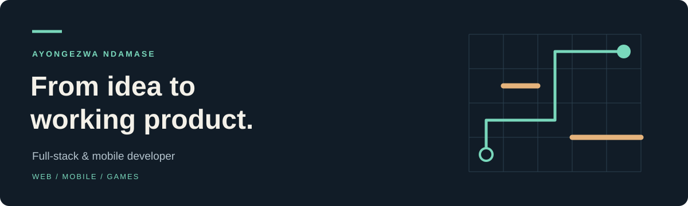

  <a href="https://www.beefiveweb.com"><strong>Play Bee Five</strong></a> &nbsp; · &nbsp;
  <a href="https://github.com/TheCyberAyo?tab=repositories"><strong>Explore my work</strong></a> &nbsp; · &nbsp;
  <a href="https://www.linkedin.com/in/ayongezwa-ndamase-761b14217"><strong>Let’s connect</strong></a>

## Software that people can use, learn from, and play.

I'm **Ayongezwa**, a South African freelance full-stack and mobile developer. I build web and mobile products from the first interface through backend integration and release, with a focus on thoughtful user experiences and practical problem-solving.

My work spans **education applications, competitive games, and interactive web experiences**. Through Mindgrind, I'm developing games that make simple rules feel rewarding to master. I bring the same attention to usability and detail to client projects.

### Selected work

**🐝 Bee Five · Competitive multiplayer for web and mobile** 
An independently developed Connect-5 game with real-time matchmaking, ELO ratings, global and institutional leaderboards, and opponent challenges. Built with **Next.js and React** for the web and **Flutter and Dart** for mobile.

[Play the game →](https://www.beefiveweb.com) · [Explore the repository →](https://github.com/TheCyberAyo/bee-five)

**Suitable Focus · Learning experiences on mobile** 
During a year-long placement through the Capaciti learnership, I designed and delivered a Flutter application with backend integration, course management, and in-app payments. That experience shaped how I approach complete features, from the interface to the services behind it.

[Explore the Flutter project →](https://github.com/TheCyberAyo/suitableFocus2.0)

**Trailblock · A strategy game in development** 
A turn-based race across a 10×10 board: move your piece or place a wall, while keeping a route open for every player. Built with **React and TypeScript**, with AI opponents, touch controls, offline support, and **Capacitor** scaffolding for mobile.

### What I bring to a project

- **Web and mobile delivery:** responsive interfaces, application logic, backend integration, and release preparation.
- **Interactive product experience:** multiplayer flows, rankings, game rules, and interfaces that make complex behaviour understandable.
- **An evidence-led approach:** break problems down, test assumptions, and check that the finished feature works for its intended user.

### Tools I work with

**Web:** TypeScript · JavaScript · React.js · Next.js · HTML · CSS 
**Mobile:** Flutter · Dart · Capacitor · Xcode · Android Studio 
**Backend & delivery:** Node.js · Firebase · Supabase · Git · Vercel 
**Design:** Figma

I also use AI-assisted development tools, with review and testing as part of the delivery process.

### A little more about me

I'm a **CodeSpace Academy graduate** and completed the **Capaciti learnership**. Before software, I completed three years of academic credits towards a BSc in Dietetics at the University of the Western Cape. That science background informs my interest in health, wellness, and education products.

Away from the keyboard, you'll find me running, hiking, or enjoying a strategy game. I like work—and hobbies—that reward patience, curiosity, and consistent improvement.

---

**Available for freelance web and mobile projects**, especially in education, health, wellness, and games.

Have a product in mind? [Connect with me on LinkedIn →](https://www.linkedin.com/in/ayongezwa-ndamase-761b14217)
